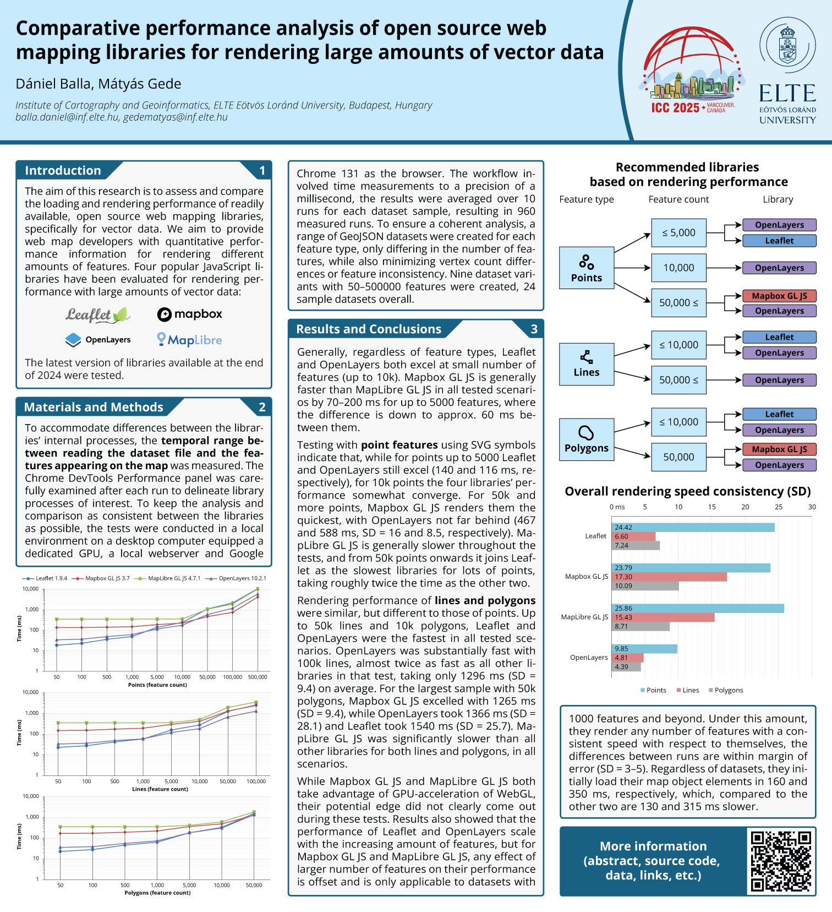

# Comparative performance analysis of open source web mapping libraries for rendering large amounts of vector data

Poster presented at the [32nd International Cartographic Conference (ICC 2025)](https://icc2025.com/), 17 – 22 August 2025, in Vancouver, Canada. Exhibit Hall A / Poster Session D - 10d.

Abstract (pre-release): [PDF](abstract_icc2025_20250506_final.pdf).

Abstract (Abstracts of the ICA): `TBD`.

